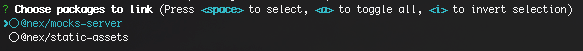

[![Build status][travisci-image]][travisci-url] [![Coverage Status][coveralls-image]][coveralls-url] [![Quality Gate][quality-gate-image]][quality-gate-url]

[![NPM dependencies][npm-dependencies-image]][npm-dependencies-url] [![Last commit][last-commit-image]][last-commit-url] [![Last release][release-image]][release-url] 

[![NPM downloads][npm-downloads-image]][npm-downloads-url] [![License][license-image]][license-url]

# Npm file link

CLI for automatically linking npm repositories locally using \"file:\" method.

### Install

```bash
npm i @xbyorange/npm-file-link -g
```

### Usage

**All npm package repositories to be linked have to be under the same folder**.

#### Linking an specific package:

Inside any package folder you can run:

```bash
file-link
```

The tool will find dependencies able to be linked because are cloned locally too, and will let you choose which ones to link using a CLI:



Once you have chosen the dependencies to link, it will replace them locally by the correspondent `file:..` dependency in the current package and will run an `npm i` automatically. (Previous defined versions of the dependencies will be stores into a `.npm-file-link` file automatically generated in the repository, and will be restored when the `file-unlink` command is executed)

To remove all links in the current package, restore dependencies to their original versions, and reinstall them:

```bash
file-unlink
```

### Linking all packages

Inside any package folder, or in the parent folder you can run:

```bash
file-link-all
```

This command will replace all packages inter-dependencies by the correspondent `file:..` dependency, so they will be effectively linked after executing `npm i` in each package folder.

Unlink all packages:

```bash
file-unlink-all
```

### Caveats

Linked packages have have modifications in the `package.json` and in the `package-lock.json` file that should never be pushed to the remote repository.

**Before pushing any change, you must execute:**

```bash
file-unlink-all
```

To avoid pushing local links to the remote repository, this package provides a `check` command that should be executed as a precommit hook.

```bash
avoid-file-links
```

Here are the steps to configure the precommit command in all packages that may be locally linked:

```bash
npm i --save-dev @xbyorange/npm-file-link husky
```

Add next scripts and [husky](https://www.npmjs.com/package/husky) configuration to the `package.json` file:

```json
{
  "scripts": {
    "avoid-file-links": "avoid-file-links"
  },
  "husky": {
    "hooks": {
      "pre-commit": "npm run avoid-file-links"
    }
  }
}
```

Now, when trying to push any change that includes a local link in the `package.json` or `package-lock.json` files, the user will receive an error like:

```bash
ERROR: Please remove file links. Run "file-unlink-all".
```

## Contributing

Contributors are welcome.
Please read the [contributing guidelines](.github/CONTRIBUTING.md) and [code of conduct](.github/CODE_OF_CONDUCT.md).

[coveralls-image]: https://coveralls.io/repos/github/XbyOrange/npm-file-link/badge.svg
[coveralls-url]: https://coveralls.io/github/XbyOrange/npm-file-link
[travisci-image]: https://travis-ci.com/xbyorange/npm-file-link.svg?branch=master
[travisci-url]: https://travis-ci.com/xbyorange/npm-file-link
[last-commit-image]: https://img.shields.io/github/last-commit/xbyorange/npm-file-link.svg
[last-commit-url]: https://github.com/xbyorange/npm-file-link/commits
[license-image]: https://img.shields.io/npm/l/@xbyorange/npm-file-link.svg
[license-url]: https://github.com/xbyorange/npm-file-link/blob/master/LICENSE
[npm-downloads-image]: https://img.shields.io/npm/dm/@xbyorange/npm-file-link.svg
[npm-downloads-url]: https://www.npmjs.com/package/@xbyorange/npm-file-link
[npm-dependencies-image]: https://img.shields.io/david/xbyorange/npm-file-link.svg
[npm-dependencies-url]: https://david-dm.org/xbyorange/npm-file-link
[quality-gate-image]: https://sonarcloud.io/api/project_badges/measure?project=xbyorange-npm-file-link&metric=alert_status
[quality-gate-url]: https://sonarcloud.io/dashboard?id=xbyorange-npm-file-link
[release-image]: https://img.shields.io/github/release-date/xbyorange/npm-file-link.svg
[release-url]: https://github.com/xbyorange/npm-file-link/releases
